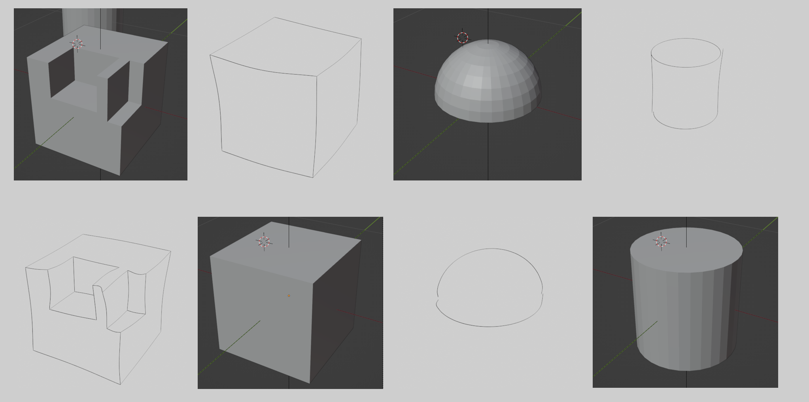
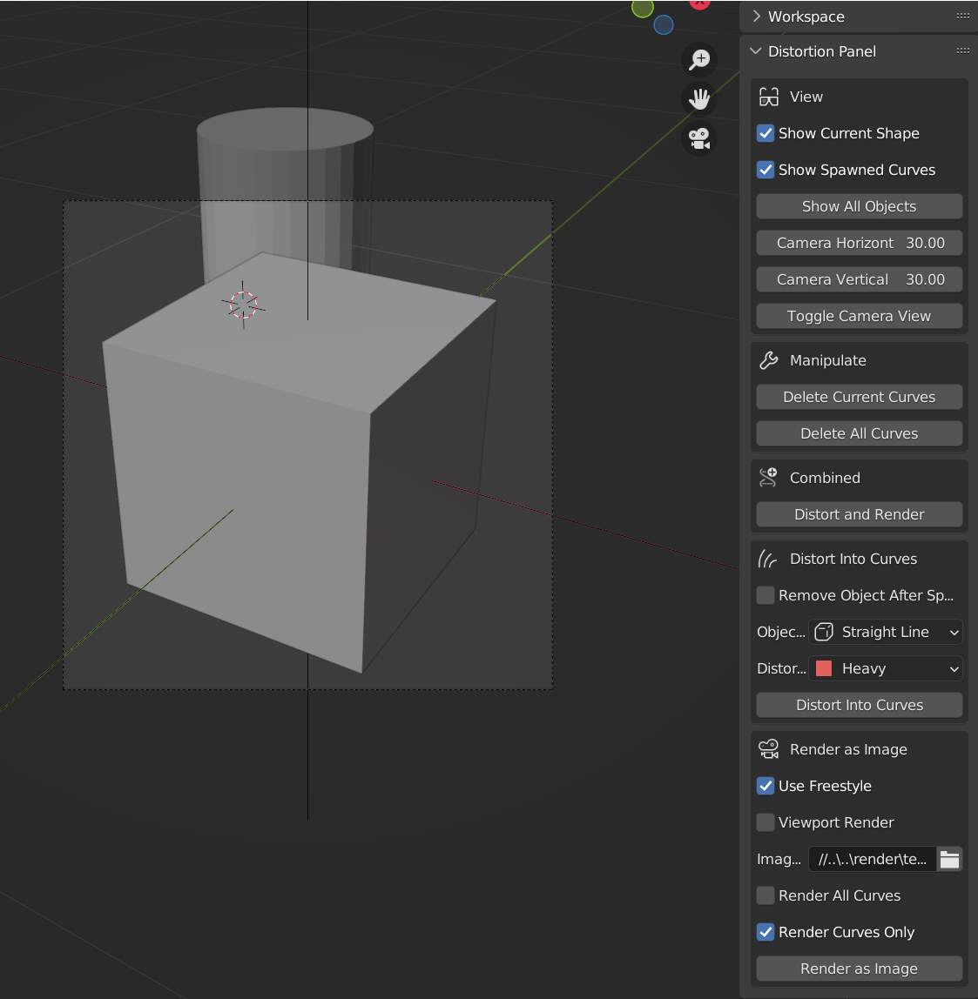

Distortion Renderer for cylinders, half-spheres and arbitrary straight-line shapes. 

Install python environment: 
 - `conda create -n "distortion" python=3.10`
 - `pip install -r ./requirements.txt`

Activate conda environment through `conda activate distortion`

Download blender 3.2 from https://download.blender.org/release/Blender3.2/ and unzip into `./blender`; 

Remove blender's bundled python folder at `./blender/blender-3.2.2-windows.x64/3.2/python`
 - or copy paste conda's python env folder (e.g. envs/distortion) into ./3.2 and rename it to python; 

Remove the freestyle folder at `<conda_path>/envs/distortion/Lib/site-packages/freestyle` to make blender fallback to its own freestyle module. 
 - consequently, the path will be `3.2/python/Lib/site-packages/freestyle`

Running driver.py with environment activated:

Select an object with left click (which will be highlighted) and press `Distort and Render`, a sketch-like results will be at `render/temp.png`. 

Separate distortion and rendering pipeline is also available, along with several auxiliary functionalities. 
